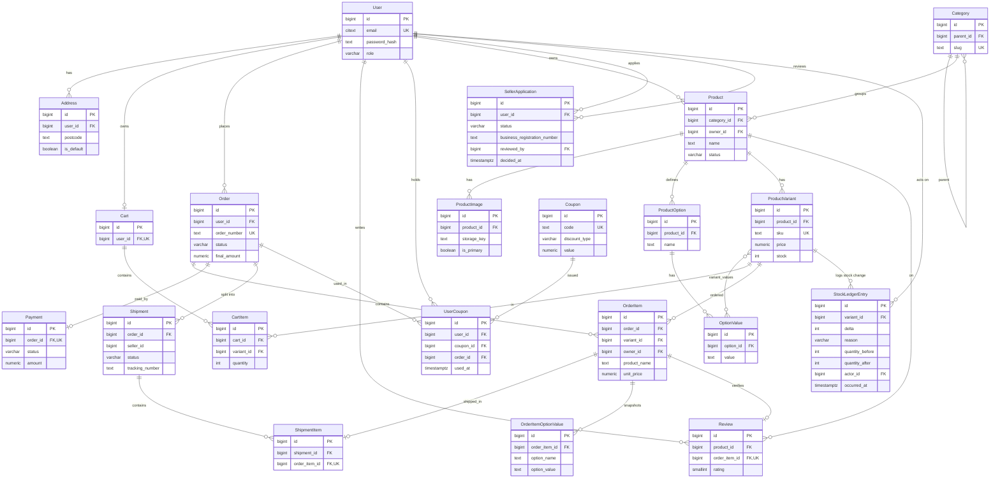

# 쇼핑몰 DB 설계 문서

> 개인 사이드 프로젝트(포트폴리오용) 쇼핑몰의 데이터베이스 설계 문서.
> 스키마의 정본(source of truth)은 Flyway 마이그레이션이며(shop-core `V1`~`V11`, notification `V1`~`V2`), 이 문서는 그 구조와 설계 의도를 설명한다.

> **문서 동기화 메모(2026-06-19)**: shop-core 스키마는 `V1`~`V11`까지 적용돼 있으며, 본 문서 §2~§9는 전 테이블(회원/판매자 온보딩/카탈로그/재고 원장/주문/결제/배송/쿠폰/리뷰 + Outbox)을 반영한다. V3 상품 소유자(`products.owner_id`)·status 대문자화는 §4.2, V4 배송(`shipments`, `shipment_items`)은 §4.4, V5 판매자 신청(`seller_application`)은 §4.1, V6 계정 라이프사이클(`users.status`/`deleted_at`)은 §4.1에 기술한다. **V7~V11 반영(2026-06-19)**: V7 DB 세션 기본 타임존 KST(스키마 무변경 — §8), V8 재고 변동 원장(`inventory_stock_ledger` 신규 테이블 — §4.2·`inventory` 모듈), V9 마지막 로그인(`users.last_login_at` — §4.1), V10 주문항목 판매자 스냅샷(`order_items.owner_id` — §4.4), V11 배송 판매자 백필(`shipments.seller_id` 활성화 — §4.4). notification은 **독립 PostgreSQL 인스턴스**를 쓰며 자기 소유 테이블(`processed_event`, `V1`~`V2`)만 §10에 별도 기술한다.

## 1. 개요

| 항목 | 값 |
|------|-----|
| DBMS | PostgreSQL |
| ORM | Spring Data JPA (Hibernate 6) |
| 마이그레이션 | Flyway |
| 범위 | 회원 · 판매자 온보딩 · 카탈로그(옵션/재고) · 재고 변동 원장 · 장바구니 · 주문 · 결제(mock) · 배송 · 쿠폰 · 리뷰 · 관리자 |
| 테이블 수 | shop-core 23 (도메인 22 + Outbox 인프라 1) — V4 `shipments`·`shipment_items`, V5 `seller_application`, V8 `inventory_stock_ledger` 포함 / notification 1 (`processed_event`, **독립 DB** — §10) |
| 도메인 수 | 7 (shop-core) — 회원·카탈로그·재고·장바구니·주문(결제/배송)·쿠폰·리뷰 |

### 컨벤션

- 식별자: `bigint GENERATED ALWAYS AS IDENTITY` 단일 PK
- 명명: `snake_case`, 테이블명 복수형
- 금액: `numeric(12,2)` (애플리케이션에서는 `BigDecimal`) — 부동소수점 금지
- 시각: `timestamptz` (애플리케이션에서는 `OffsetDateTime`)
- 상태값: PostgreSQL 네이티브 ENUM 대신 `varchar + CHECK` — JPA `@Enumerated(EnumType.STRING)`과 매핑하기 위함
- `created_at` / `updated_at`: DB의 `DEFAULT now()` + 트리거가 소유, 엔티티에서는 읽기 전용
- PostgreSQL 확장: 이메일 대소문자 무시를 위해 `citext` 사용 (`CREATE EXTENSION IF NOT EXISTS citext`)

## 2. 도메인 구조

| 도메인 | 영역 | 테이블 | 핵심 결정 |
|--------|------|--------|-----------|
| 회원 · 인증 | 고객 | `users`, `addresses`, `seller_application` | 역할 기반(CONSUMER/SELLER/ADMIN), 판매자 신청·심사·승격 워크플로우(V5) |
| 장바구니 | 고객 | `carts`, `cart_items` | 회원당 1개 |
| 카탈로그 | 상품 | `categories`, `products`, `product_images`, `product_options`, `option_values`, `product_variants`, `variant_values` | 옵션 정규화(집계 지원), 상품별 옵션값 |
| 재고 | 상품 | `inventory_stock_ledger` | 재고 변동 감사 원장 — 성공한 모든 변동(주문 차감/취소·만료 복원/수동 조정)을 사유·전후 수량·행위자와 기록(V8, `inventory` 모듈) |
| 주문 · 결제 · 배송 | 거래 | `orders`, `order_items`, `order_item_option_values`, `payments`, `shipments`, `shipment_items` | 주문 시점 스냅샷(판매자 `owner_id` 스냅샷 V10), 주문 1:N 배송 이행(V4·판매자 스코프 V11) |
| 쿠폰 | 거래 | `coupons`, `user_coupons` | 쿠폰함 모델(정의/발급·사용 분리) |
| 리뷰 | 거래 | `reviews` | 실구매 검증(order_item 참조) |

## 3. ERD



관계 표기: `||--o{` = 1:N, `||--o|` = 1:1, `}o--o{` = N:M(조인 테이블 `variant_values`). `Category → Category`는 카테고리 트리 자기참조. `User → SellerApplication`은 두 관계(신청자 `user_id`, 심사자 `reviewed_by`)를 가진다.

## 4. 테이블 정의

### 4.1 회원 · 인증

#### `users`
회원 계정. `role`로 일반 고객(CONSUMER), 판매자(SELLER), 관리자(ADMIN)를 구분한다(별도 관리자 테이블 없음).

| 컬럼 | 타입 | 제약 | 설명 |
|------|------|------|------|
| id | bigint | PK, identity | |
| email | citext | NOT NULL, UNIQUE | 대소문자 구분 없는 이메일 |
| password_hash | text | NOT NULL | 해시된 비밀번호 |
| name | text | NOT NULL | |
| phone | text | | |
| role | varchar(20) | NOT NULL, CHECK(CONSUMER/SELLER/ADMIN) | 기본 CONSUMER — V2 마이그레이션으로 교체(V1은 customer/admin) |
| status | varchar(20) | NOT NULL, DEFAULT 'ACTIVE', CHECK(ACTIVE/WITHDRAWN) | 계정 상태 — V6(소프트 삭제) |
| deleted_at | timestamptz | | 탈퇴 시각(활성=NULL) — V6 |
| last_login_at | timestamptz | | 마지막 로그인 시각 — V9(로그인 성공 시 갱신). `idx_users_last_login_at` |
| created_at / updated_at | timestamptz | NOT NULL, DEFAULT now() | 트리거 갱신 |

> **V2 마이그레이션 사유**: Task 006에서 `ROLE_ADMIN > ROLE_SELLER > ROLE_CONSUMER` 계층형 권한 모델 도입으로 role 값이 Java enum `Role{CONSUMER, SELLER, ADMIN}` 상수명(대문자)과 1:1 매핑되도록 변경됨. V1은 Flyway checksum으로 불변이므로 `V2__users_role_hierarchy.sql`로 처리.

> **V6 마이그레이션 사유(Task 029)**: 로그인 사용자 self-service 탈퇴를 **소프트 삭제**로 지원. 탈퇴 시 행을 물리 삭제하지 않고 `status='WITHDRAWN'` + `deleted_at`=탈퇴시각으로 전이(`orders` 등 FK 연관·감사 추적 보존). `email` UNIQUE를 유지하므로 탈퇴 행이 이메일을 점유 → 동일 email 재가입 불가(재사용 허용은 별도 Task — 부분 유니크 + 익명화 설계 필요). 활성 사용자 전용 조회는 `WHERE status='ACTIVE'`(또는 `deleted_at IS NULL`)로 인증 가드.

> **V9 마이그레이션 사유(Task 042/로그인 활동 추적)**: 로그인 성공 시각을 `users.last_login_at`에 기록한다(`MemberService.recordLoginByEmail`). 관리자 통계 대시보드의 "최근 30일 접속 활성 회원"(`countByStatusAndLastLoginAtAfter`) 분자 계산에 사용한다. `idx_users_last_login_at` 인덱스로 임계시각 이후 필터를 최적화한다. `last_login_at IS NULL`(미접속) 회원은 SQL `col > threshold`에서 자동 제외된다.

#### `addresses`
회원 배송지. 사용자당 기본 배송지는 1개만 허용(partial unique index).

| 컬럼 | 타입 | 제약 | 설명 |
|------|------|------|------|
| id | bigint | PK | |
| user_id | bigint | FK → users, NOT NULL, ON DELETE CASCADE | |
| recipient | text | NOT NULL | 수령인 |
| phone | text | NOT NULL | |
| postcode | text | NOT NULL | |
| address1 | text | NOT NULL | 기본 주소 |
| address2 | text | | 상세 주소 |
| is_default | boolean | NOT NULL, DEFAULT false | `UNIQUE(user_id) WHERE is_default` |

#### `seller_application` (V5)
판매자 권한 신청·심사·승격 워크플로우. `CONSUMER`가 사업자 정보를 담아 신청하고 `ADMIN`이 승인/반려한다. 승인 시 신청자는 `MemberService.changeRole`(Task 008 경로 재사용)로 `SELLER`로 승격되며, **이 레코드 자체(`reviewed_by`/`decided_at`/`status`/`reject_reason`)가 판매자 승격의 감사(audit) 기록**이다(별도 감사 테이블 없음).

| 컬럼 | 타입 | 제약 | 설명 |
|------|------|------|------|
| id | bigint | PK, identity | |
| user_id | bigint | FK → users, NOT NULL, ON DELETE CASCADE | 신청자 |
| status | varchar(20) | NOT NULL, CHECK(PENDING/APPROVED/REJECTED) | 상태머신. `PENDING → APPROVED \| REJECTED`(터미널) |
| business_name | text | NOT NULL | 상호명 |
| business_registration_number | text | NOT NULL | 사업자등록번호(앱 검증: 숫자 10자리, 외부 진위확인 없음) |
| contact_phone | text | NOT NULL | 담당자 연락처 |
| reject_reason | text | | 반려 사유(반려 시) |
| reviewed_by | bigint | FK → users, ON DELETE SET NULL | 심사한 ADMIN(승인/반려 시) |
| decided_at | timestamptz | | 심사(승인/반려) 시각 |
| created_at / updated_at | timestamptz | NOT NULL, DEFAULT now() | 트리거 갱신 |

- **중복 신청 차단**: 사용자당 `PENDING` 신청은 최대 1건. 부분 유니크 인덱스 `UNIQUE(user_id) WHERE status='PENDING'`로 DB 권위 가드(애플리케이션은 사전 체크 + `DataIntegrityViolationException` 흡수). `REJECTED`/`APPROVED`는 인덱스 대상이 아니므로 **반려 후 재신청을 허용**한다.
- **신청 자격은 인가가 아닌 도메인 규칙**: 신청 엔드포인트의 보안 floor는 `authenticated`이며, "현재 role==CONSUMER만 신청 가능"은 서비스가 검증해 부적격(SELLER/ADMIN)을 **409(상태 충돌)**로 거부한다(RoleHierarchy로 보안 계층에서 "상위 권한 차단"을 표현할 수 없기 때문).

### 4.2 카탈로그

#### `categories`
카테고리. `parent_id` 자기참조로 트리(대분류 → 소분류)를 구성한다.

| 컬럼 | 타입 | 제약 | 설명 |
|------|------|------|------|
| id | bigint | PK | |
| parent_id | bigint | FK → categories, ON DELETE SET NULL | 상위 카테고리 |
| name | text | NOT NULL | |
| slug | text | NOT NULL, UNIQUE | URL용 |
| sort_order | int | NOT NULL, DEFAULT 0 | |

#### `products`
상품 기본 정보. 재고/가격은 여기가 아니라 `product_variants`에 있다.

| 컬럼 | 타입 | 제약 | 설명 |
|------|------|------|------|
| id | bigint | PK | |
| category_id | bigint | FK → categories, ON DELETE SET NULL | |
| owner_id | bigint | FK → users, ON DELETE RESTRICT | 판매자/소유자 식별 — V3(소유권 검사용, nullable, 앱이 등록 시 채움). `idx_products_owner_id` |
| name | text | NOT NULL | |
| description | text | | |
| base_price | numeric(12,2) | NOT NULL, CHECK ≥ 0 | 대표 표시가 |
| status | varchar(20) | NOT NULL, CHECK(DRAFT/ON_SALE/SOLD_OUT/HIDDEN) | V1 소문자 → V3에서 대문자 교체(JPA enum 정합, V2 role 패턴 계승). DEFAULT 없음 → 등록 기본 DRAFT는 앱(`ProductService.create`)이 강제 |
| created_at / updated_at | timestamptz | NOT NULL | |

#### `product_images`

| 컬럼 | 타입 | 제약 | 설명 |
|------|------|------|------|
| id | bigint | PK | |
| product_id | bigint | FK → products, NOT NULL, CASCADE | |
| storage_key | text | NOT NULL | 호스트를 포함하지 않은 객체 저장소 키 |
| sort_order | int | NOT NULL, DEFAULT 0 | |
| is_primary | boolean | NOT NULL, DEFAULT false | 대표 이미지 |

대표 이미지는 상품당 1개만 허용한다. 마이그레이션에서는 `UNIQUE(product_id) WHERE is_primary` partial unique index로 보장한다.

#### `product_options`
옵션의 "종류"(예: 색상, 사이즈).

| 컬럼 | 타입 | 제약 | 설명 |
|------|------|------|------|
| id | bigint | PK | |
| product_id | bigint | FK → products, NOT NULL, CASCADE | |
| name | text | NOT NULL | `UNIQUE(product_id, name)` |

#### `option_values`
옵션 종류별 "값"(예: 빨강, 파랑 / S, M, L). 상품(옵션)에 종속되므로 상품마다 별도 행을 가진다.

| 컬럼 | 타입 | 제약 | 설명 |
|------|------|------|------|
| id | bigint | PK | |
| option_id | bigint | FK → product_options, NOT NULL, CASCADE | |
| value | text | NOT NULL | `UNIQUE(option_id, value)` |

#### `product_variants`
실제 구매 단위(SKU). 옵션값들의 한 조합이며, **재고와 가격을 가진다.**

| 컬럼 | 타입 | 제약 | 설명 |
|------|------|------|------|
| id | bigint | PK | |
| product_id | bigint | FK → products, NOT NULL, CASCADE | |
| sku | text | NOT NULL, UNIQUE | |
| price | numeric(12,2) | NOT NULL, CHECK ≥ 0 | |
| stock | int | NOT NULL, DEFAULT 0, CHECK ≥ 0 | 음수 재고 방지 |
| is_active | boolean | NOT NULL, DEFAULT true | 소프트 삭제용 |
| created_at | timestamptz | NOT NULL | |

#### `variant_values`
variant ↔ 옵션값 매핑(조인 테이블). variant 1개당 옵션 종류 수만큼 행이 생긴다(예: 색상+사이즈 → 2행). JPA에서는 `@ManyToMany`의 조인 테이블.

| 컬럼 | 타입 | 제약 | 설명 |
|------|------|------|------|
| variant_id | bigint | FK → product_variants, CASCADE | 복합 PK |
| option_value_id | bigint | FK → option_values, CASCADE | 복합 PK |

#### `inventory_stock_ledger` (V8)
재고 변동 감사 원장. **성공한 모든 재고 변동**(주문 차감·취소/만료 복원·운영자 수동 조정)을 사유·전후 수량·행위자와 함께 append-only로 기록한다. `inventory` 모듈 소유(엔티티 `StockLedgerEntry`). `product_variants.stock`이 "현재 재고"의 정본이고, 이 테이블은 변동 **이력**의 정본이다.

| 컬럼 | 타입 | 제약 | 설명 |
|------|------|------|------|
| id | bigint | PK, identity | |
| variant_id | bigint | FK → product_variants, NOT NULL, ON DELETE CASCADE | 변동 대상 SKU |
| delta | int | NOT NULL | 부호 있는 변동량(차감=음수, 복원/증분=양수) |
| reason | varchar(20) | NOT NULL, CHECK(ORDER_DECREASE/CANCEL_RESTORE/EXPIRY_RESTORE/ADJUSTMENT) | 변동 사유 |
| quantity_before | int | NOT NULL, CHECK ≥ 0 | 변동 전 재고 |
| quantity_after | int | NOT NULL, CHECK ≥ 0 | 변동 후 재고 |
| actor_id | bigint | FK → users, ON DELETE SET NULL | 행위자(시스템 변동=NULL, 운영자=users.id) |
| memo | text | | 변동 메모(ADJUSTMENT 필수, 그 외 NULL) |
| occurred_at | timestamptz | NOT NULL | 변동 발생 시각 |

- **append-only**: INSERT 전용, UPDATE 없음 → `updated_at` 컬럼·트리거 없음(엔티티는 `BaseEntity` 미상속, `occurred_at`만 시각 컬럼).
- **수량 컬럼은 전부 `int`**(`product_variants.stock`과 동형). `smallint`를 쓰면 JPA `int` 매핑 시 `entityManagerFactory`가 깨지므로 회피한다.
- **인덱스**: `idx_inventory_stock_ledger_variant_id`(SKU별 이력 조회), `idx_inventory_stock_ledger_occurred_at`(기간 조회).

### 4.3 장바구니

#### `carts`

| 컬럼 | 타입 | 제약 | 설명 |
|------|------|------|------|
| id | bigint | PK | |
| user_id | bigint | FK → users, NOT NULL, UNIQUE, CASCADE | 회원당 1개 |
| created_at / updated_at | timestamptz | NOT NULL | |

#### `cart_items`

| 컬럼 | 타입 | 제약 | 설명 |
|------|------|------|------|
| id | bigint | PK | |
| cart_id | bigint | FK → carts, NOT NULL, CASCADE | |
| variant_id | bigint | FK → product_variants, NOT NULL, CASCADE | |
| quantity | int | NOT NULL, CHECK > 0 | |
| added_at | timestamptz | NOT NULL | `UNIQUE(cart_id, variant_id)` |

### 4.4 주문 · 결제

#### `orders`
주문 헤더. 금액과 배송지는 모두 **주문 시점에 확정된 스냅샷**이다.

| 컬럼 | 타입 | 제약 | 설명 |
|------|------|------|------|
| id | bigint | PK | |
| user_id | bigint | FK → users, NOT NULL, ON DELETE RESTRICT | |
| order_number | text | NOT NULL, UNIQUE | 사람이 읽는 주문번호 |
| status | varchar(20) | NOT NULL, CHECK | pending/paid/preparing/shipping/delivered/cancelled/refunded |
| items_amount | numeric(12,2) | NOT NULL, CHECK ≥ 0 | 상품 합계 |
| discount_amount | numeric(12,2) | NOT NULL, DEFAULT 0 | 할인액 |
| shipping_fee | numeric(12,2) | NOT NULL, DEFAULT 0 | 배송비 |
| final_amount | numeric(12,2) | NOT NULL, CHECK ≥ 0 | 실 결제액 |
| ship_recipient / ship_phone / ship_postcode / ship_address1 / ship_address2 | text | 배송지 스냅샷 | address 변경과 무관하게 불변 |
| created_at / updated_at | timestamptz | NOT NULL | |

#### `order_items`
주문 항목. `variant_id`는 참조용(nullable)이고, 표시·정산에 쓰는 값은 **주문 시점 복사본**이다.

| 컬럼 | 타입 | 제약 | 설명 |
|------|------|------|------|
| id | bigint | PK | |
| order_id | bigint | FK → orders, NOT NULL, CASCADE | |
| variant_id | bigint | FK → product_variants, ON DELETE SET NULL | 참조용 |
| owner_id | bigint | | 판매자(`users.id`) 스냅샷 — V10. 주문 생성 시 `products.owner_id` 적재. variant SET NULL된 백필 행은 NULL 잔존. `idx_order_items_owner_id`(판매자 주문 목록 페이지네이션) |
| product_name | text | NOT NULL | 스냅샷 |
| option_label | text | | 예: "빨강 / L" |
| unit_price | numeric(12,2) | NOT NULL, CHECK ≥ 0 | 스냅샷 |
| quantity | int | NOT NULL, CHECK > 0 | |
| line_amount | numeric(12,2) | NOT NULL, CHECK ≥ 0 | unit_price × quantity |

> **V10 마이그레이션 사유(Task 048 판매자 주문 조회)**: 판매자가 자기 상품이 포함된 주문 항목을 조회하기 위한 `owner_id` 스칼라 스냅샷. `owner_id = products.owner_id`(상품 소유자=판매자). variant 교차참조 없이 `WHERE owner_id = :sellerId`로 페이지네이션한다(인덱스 `idx_order_items_owner_id`). 기존 행은 `variant_id → product_variants → products.owner_id` 조인으로 백필했고, variant가 SET NULL된 행은 `owner_id` NULL 잔존을 허용한다(스냅샷 손실 명시).

#### `order_item_option_values`
주문 항목의 옵션값 스냅샷. `variant_values`는 현재 상품 옵션 구성을 나타내므로, 과거 주문의 옵션 집계는 이 테이블을 기준으로 한다.

| 컬럼 | 타입 | 제약 | 설명 |
|------|------|------|------|
| id | bigint | PK | |
| order_item_id | bigint | FK → order_items, NOT NULL, CASCADE | |
| option_name | text | NOT NULL | 주문 시점 옵션명 예: 색상 |
| option_value | text | NOT NULL | 주문 시점 옵션값 예: 빨강 |
| sort_order | int | NOT NULL, DEFAULT 0 | 옵션 표시 순서 |

#### `payments`
주문과 1:1. 현재 결제는 mock이지만 구조는 실제 PG 연동을 가정한다.

| 컬럼 | 타입 | 제약 | 설명 |
|------|------|------|------|
| id | bigint | PK | |
| order_id | bigint | FK → orders, NOT NULL, UNIQUE, ON DELETE RESTRICT | |
| method | varchar(20) | NOT NULL, CHECK(card/bank_transfer/virtual_account/mock) | |
| status | varchar(20) | NOT NULL, CHECK(ready/paid/failed/cancelled/refunded) | |
| amount | numeric(12,2) | NOT NULL, CHECK ≥ 0 | |
| pg_transaction_id | text | | PG 응답값(mock은 가짜 값) |
| paid_at | timestamptz | | |
| created_at / updated_at | timestamptz | NOT NULL | |

#### `shipments` (V4)
배송 단위. 주문 이행(fulfillment)을 배송 단위로 모델링한다. **한 주문(`orders`)은 여러 배송으로 나뉠 수 있다**(1:N). 상태 전이(`preparing → shipping → delivered`)는 Task 020(배송 시작)·021(배송 완료)에서 사용한다.

| 컬럼 | 타입 | 제약 | 설명 |
|------|------|------|------|
| id | bigint | PK, identity | |
| order_id | bigint | FK → orders, NOT NULL, ON DELETE CASCADE | |
| seller_id | bigint | | 판매자 범위 이행 식별자(nullable). V11 백필로 활성화 — 판매자가 자기 배송을 ship/deliver하는 스코프 가드(`SellerFulfillmentFacadeImpl.verifySellerOwnership`)에 사용. Task 049부터 신규 배송은 생성 시 stamp |
| status | varchar(20) | NOT NULL, CHECK(preparing/shipping/delivered) | 배송 상태머신 |
| carrier | text | | 택배사(배송 시작 시) |
| tracking_number | text | | 송장번호(배송 시작 시) |
| shipped_at | timestamptz | | 발송 시각(Task 020) |
| delivered_at | timestamptz | | 배송 완료 시각(Task 021) |
| created_at / updated_at | timestamptz | NOT NULL, DEFAULT now() | 트리거 갱신 |

> **V11 마이그레이션 사유(Task 049/050 판매자 이행 스코프)**: V4에서 `seller_id`는 nullable 이음매로만 존재했으나, 판매자 배송 이행 도입으로 활성화한다. V11은 **DDL 변경 없이 UPDATE만** 수행 — admin이 생성한 레거시 배송 중 `shipment_items → order_items.owner_id` 조인으로 "전 항목이 동일 단일 소유자이고 owner 불명(NULL) 항목이 0건"인 경우에만 `seller_id`를 백필한다. 혼합 소유자·owner 불명 포함 배송은 NULL 유지(admin 전용 잔존). 백필된 배송은 의도적으로 해당 판매자가 ship/deliver 가능해진다(레거시를 seller 스코프 모델로 편입).

#### `shipment_items` (V4)
배송 항목. 배송(`shipments`)과 주문 항목(`order_items`)의 매핑(조인). **`order_item_id` UNIQUE 제약으로 한 주문 항목은 최대 1개 배송에만 속한다.** `updated_at`이 없는 append-only 테이블이라 트리거가 없다.

| 컬럼 | 타입 | 제약 | 설명 |
|------|------|------|------|
| id | bigint | PK, identity | |
| shipment_id | bigint | FK → shipments, NOT NULL, ON DELETE CASCADE | |
| order_item_id | bigint | FK → order_items, NOT NULL, ON DELETE CASCADE | `UNIQUE(order_item_id)` — 주문 항목당 1배송 |
| created_at | timestamptz | NOT NULL, DEFAULT now() | |

### 4.5 쿠폰

#### `coupons`
쿠폰 정의(규칙).

| 컬럼 | 타입 | 제약 | 설명 |
|------|------|------|------|
| id | bigint | PK | |
| code | text | NOT NULL, UNIQUE | |
| name | text | NOT NULL | |
| discount_type | varchar(10) | NOT NULL, CHECK(fixed/percent) | 정액/정률 |
| value | numeric(12,2) | NOT NULL, CHECK > 0 | |
| min_order_amount | numeric(12,2) | NOT NULL, DEFAULT 0 | 최소 주문금액 |
| max_discount | numeric(12,2) | | percent 상한 |
| starts_at / ends_at | timestamptz | NOT NULL, CHECK(ends_at > starts_at) | 유효기간 |
| usage_limit | int | | 총 사용 한도(NULL=무제한) |
| used_count | int | NOT NULL, DEFAULT 0 | |
| is_active | boolean | NOT NULL, DEFAULT true | |

#### `user_coupons`
사용자에게 발급된 쿠폰 / 사용 내역. `order_id`/`used_at`이 NULL이면 미사용(쿠폰함 보유) 상태.

| 컬럼 | 타입 | 제약 | 설명 |
|------|------|------|------|
| id | bigint | PK | |
| user_id | bigint | FK → users, NOT NULL, CASCADE | 소유자 |
| coupon_id | bigint | FK → coupons, NOT NULL, CASCADE | |
| order_id | bigint | FK → orders, ON DELETE SET NULL | 사용된 주문 |
| issued_at | timestamptz | NOT NULL | 발급 시각 |
| used_at | timestamptz | | 사용 시각 |
| | | UNIQUE(user_id, coupon_id) | 1인 1매(정책에 따라 제거 가능) |

### 4.6 리뷰

#### `reviews`
상품 리뷰. `order_item_id`를 참조해 실구매를 검증하고, 그 UNIQUE 제약으로 "구매 1건당 리뷰 1개"를 보장한다.

| 컬럼 | 타입 | 제약 | 설명 |
|------|------|------|------|
| id | bigint | PK | |
| product_id | bigint | FK → products, NOT NULL, CASCADE | |
| user_id | bigint | FK → users, NOT NULL, CASCADE | |
| order_item_id | bigint | FK → order_items, NOT NULL, UNIQUE, ON DELETE RESTRICT | 실구매 검증 |
| rating | smallint | NOT NULL, CHECK(1~5) | |
| content | text | | |
| created_at / updated_at | timestamptz | NOT NULL | |

### 4.7 인프라 — Transactional Outbox

#### `event_publication`
Spring Modulith **Event Publication Registry**(Transactional Outbox)가 사용하는 테이블. shop-core가 도메인 트랜잭션과 함께 이벤트를 저장한 뒤 Kafka로 외부화하고, 외부화가 끝나면 `completion_date`를 채운다(`architecture.md` §4 발행 신뢰성). 스키마는 Spring Modulith 표준 컬럼을 따르며, **Flyway가 소유**한다(아래 8장 참조). 이 테이블은 프레임워크 소유 인프라이므로 도메인 명명/식별자 컨벤션(복수형·bigint identity)을 예외로 두고 표준 스키마를 그대로 쓴다.

| 컬럼 | 타입 | 제약 | 설명 |
|------|------|------|------|
| id | uuid | PK | 발행 식별자(프레임워크 생성) |
| listener_id | text | NOT NULL | 리스너 식별자 |
| event_type | text | NOT NULL | 이벤트 타입 |
| serialized_event | text | NOT NULL | 직렬화된 이벤트(JSON) |
| publication_date | timestamptz | NOT NULL | 발행(저장) 시각 |
| completion_date | timestamptz | | 외부화 완료 시각(NULL=미완료) |

- 미완료 행(`completion_date IS NULL`)은 재시도 대상이며, 완료 행은 보존 정책에 따라 주기적으로 정리할 수 있다.

## 5. 핵심 설계 결정

1. **주문 시점 스냅샷** — `order_items`는 variant를 FK로만 참조하지 않고 `product_name`, `unit_price`, `option_label`을 복사 저장한다. 옵션 집계용 값은 `order_item_option_values`에 `option_name`, `option_value`로 복사한다. 이후 상품 가격/이름/옵션 구성이 바뀌거나 variant가 삭제돼도 과거 주문과 정산·집계 금액은 불변이다. 배송지도 `orders`에 스냅샷으로 복사한다.

2. **옵션 정규화 (현재 상품 구성 + 주문 스냅샷 분리)** — 현재 상품 옵션은 `product_options` → `option_values` → `product_variants` + `variant_values`로 정규화한다. 과거 주문 집계는 현재 variant 구성이 아니라 `order_item_option_values` 스냅샷을 기준으로 한다. 라벨 문자열만 두면 집계 시 파싱이 필요해 인덱스도 못 타고 정합성도 깨진다.

3. **상품별 옵션값** — `option_values`는 product_option에 종속된다. 상품 간 "빨강" 문자열은 중복되지만 구조가 단순하고 상품마다 옵션 구성이 자유롭다. 전역 속성 마스터 테이블은 이 규모에 과하다고 판단.

4. **재고/가격은 variant에** — 같은 상품이라도 옵션 조합(빨강 L 등)마다 재고와 가격이 독립적이어야 하므로 `product_variants`에 둔다.

5. **소프트 삭제(variant)** — variant는 물리 삭제 대신 `is_active = false`로 처리한다. 과거 주문은 스냅샷으로 보존하지만, 운영 화면과 참조 조회에서 SKU 이력을 추적할 수 있게 하기 위함이다.

6. **쿠폰함 모델** — `coupons`(정의)와 `user_coupons`(발급·사용)를 분리한다. 코드 입력 방식도 "입력 시점에 user_coupon 행 생성"으로 같은 구조를 재사용할 수 있는 상위 모델이다.

7. **결제 분리** — 결제는 mock이지만 `payments`를 독립 테이블로 두고 주문과 1:1로 연결, `pg_transaction_id` 자리를 미리 마련해 실연동을 대비한다.

8. **enum = varchar + CHECK** — PostgreSQL 네이티브 ENUM은 Hibernate 매핑 시 캐스팅 문제가 있어, `varchar + CHECK`로 두고 JPA `@Enumerated(EnumType.STRING)`과 매핑한다.

9. **금액 = numeric / BigDecimal** — 부동소수점 오차를 피하기 위해 `double`이 아닌 `numeric(12,2)` ↔ `BigDecimal`을 사용한다.

10. **Outbox 스키마는 Flyway 소유** — Spring Modulith의 JDBC 스키마 자동 초기화(`spring.modulith.events.jdbc.schema-initialization.enabled`)는 **끈다**. `event_publication` 테이블도 다른 테이블과 동일하게 Flyway 마이그레이션(V1)에서 생성해, "스키마 소유권은 Flyway 하나" 원칙과 `ddl-auto=validate`를 깨지 않는다.

## 6. 동시성 처리 (재고 차감)

재고 단순 `stock = stock - n`은 동시 주문 시 음수 재고를 유발할 수 있다. 트랜잭션 안에서 조건부 업데이트로 처리한다.

```sql
UPDATE product_variants
   SET stock = stock - :qty
 WHERE id = :variant_id AND stock >= :qty;
-- 영향 행 수가 0이면 재고 부족 → 롤백
```

`CHECK (stock >= 0)`는 2차 방어선이다. 강한 정합성이 필요하면 `SELECT ... FOR UPDATE`(비관적 락)를 사용한다.

쿠폰 총 사용 한도(`coupons.usage_limit` vs `used_count`)도 동시 발급·사용 시 재고와 동일한 race가 있어 한도 초과를 유발할 수 있다. 같은 조건부 업데이트로 처리한다.

```sql
UPDATE coupons
   SET used_count = used_count + 1
 WHERE id = :coupon_id
   AND (usage_limit IS NULL OR used_count < usage_limit);
-- 영향 행 수가 0이면 한도 소진 → 롤백
```

`user_coupons`의 `UNIQUE(user_id, coupon_id)`는 1인 1매(중복 발급)를 막을 뿐 총 한도와는 별개다.

## 7. 집계 예시 (옵션값별 매출)

```sql
SELECT oiov.option_name, oiov.option_value,
       SUM(oi.quantity)    AS sold_qty,
       SUM(oi.line_amount) AS revenue
FROM order_items oi
JOIN orders o ON o.id = oi.order_id AND o.status IN ('paid','delivered')
JOIN order_item_option_values oiov ON oiov.order_item_id = oi.id
GROUP BY oiov.option_name, oiov.option_value
ORDER BY oiov.option_name, revenue DESC;
```

## 8. 마이그레이션 / JPA 운영

- 스키마 소유권은 **Flyway**에 있다. `spring.jpa.hibernate.ddl-auto=validate`로 두고 Hibernate는 검증만 한다(`update`/`create` 금지).
- 마이그레이션 파일은 `src/main/resources/db/migration/`에 위치하며 `V1__init_schema.sql`이 베이스라인이다.
- **적용된 마이그레이션은 절대 수정하지 않는다.** 스키마 변경은 항상 `V2__`, `V3__`… 로 새 파일을 추가한다(checksum 불일치 방지).
- `created_at` / `updated_at`은 DB가 소유한다. JPA `BaseEntity`에서는 읽기 전용 컬럼으로 매핑하고, 애플리케이션에서 직접 갱신하지 않는다.
- `updated_at` 자동 갱신은 **V1 마이그레이션에서 트리거 함수 1개 + 대상 테이블별 트리거**로 구현한다. `updated_at`을 가진 테이블(`users`, `products`, `carts`, `orders`, `payments`, `reviews` 등)에 동일 함수를 붙인다.

  ```sql
  CREATE OR REPLACE FUNCTION set_updated_at()
  RETURNS trigger AS $$
  BEGIN
    NEW.updated_at = now();
    RETURN NEW;
  END;
  $$ LANGUAGE plpgsql;

  -- updated_at을 가진 테이블마다 반복
  CREATE TRIGGER trg_users_set_updated_at
    BEFORE UPDATE ON users
    FOR EACH ROW EXECUTE FUNCTION set_updated_at();
  ```
- V1 마이그레이션에는 `CREATE EXTENSION IF NOT EXISTS citext;`를 포함한다.
- **V7 — DB 세션 기본 타임존 KST(ADR-009)**: `ALTER DATABASE "${flyway:database}" SET timezone TO 'Asia/Seoul'`로 세션 기본 표시 타임존만 KST로 둔다. **스키마·데이터 무변경**(`timestamptz` 절대시각 불변) — psql/DB 툴 조회 시 `created_at` 등이 KST로 보이며, 앱은 `Instant` 매핑이라 동작 영향 없음. 새로 맺는 세션부터 적용되므로 커넥션 풀은 앱 재기동 후 반영된다.
- **Outbox(`event_publication`) 테이블도 V1 마이그레이션에 포함**한다. Spring Modulith의 스키마 자동 초기화는 끄고(`spring.modulith.events.jdbc.schema-initialization.enabled=false`) Flyway가 단독으로 소유한다. 완료 이벤트 정리(보존 기간 경과분 삭제)는 운영 정책으로 별도 처리한다.

## 9. 인덱스 요약

| 테이블 | 인덱스 | 목적 |
|--------|--------|------|
| users | `(last_login_at)` | 최근 접속 활성 회원 집계(V9) |
| addresses | `(user_id)`, `UNIQUE(user_id) WHERE is_default` | 조회 / 기본배송지 1개 |
| seller_application | `(user_id)`, `(status)`, `UNIQUE(user_id) WHERE status='PENDING'` | 신청 조회·상태 필터 / PENDING 1건(중복 신청 차단) |
| products | `(category_id)`, `(status)`, `(owner_id)` | 카테고리·상태 필터 / 소유자(V3) |
| product_images | `(product_id)`, `UNIQUE(product_id) WHERE is_primary` | 상품 이미지 조회 / 대표 이미지 1개 |
| product_variants | `(product_id)` | 상품별 variant 조회 |
| inventory_stock_ledger | `(variant_id)`, `(occurred_at)` | SKU별 재고 변동 이력 / 기간 조회(V8) |
| orders | `(user_id)`, `(status)`, `(created_at)` | 주문 조회/집계 |
| order_items | `(order_id)`, `(variant_id)`, `(owner_id)` | 항목·집계 JOIN / 판매자 주문 목록(V10) |
| order_item_option_values | `(order_item_id)`, `(option_name, option_value)` | 주문 시점 옵션 집계 |
| shipments | `(order_id)` | 주문별 배송 조회 |
| shipment_items | `(shipment_id)`, `UNIQUE(order_item_id)` | 배송별 항목 / 주문 항목당 1배송 |
| user_coupons | `(user_id)`, `(user_id) WHERE used_at IS NULL` | 미사용 쿠폰 조회 |
| reviews | `(product_id)`, `(user_id)` | 상품/회원 리뷰 |

> **§9 메모 (Task 008)**: 관리자 회원 검색(`GET /api/v1/admin/members`, `GET /admin/members`)에서 `users.role` 필터를 사용한다. 현재 `(role)` 단독 인덱스는 없으며, 본 Task는 신규 마이그레이션을 만들지 않는다. 데이터가 충분히 증가하면 `CREATE INDEX ON users(role)` 인덱스를 후속 마이그레이션으로 추가 검토한다.

## 10. notification 스키마 (독립 인스턴스)

> notification은 shop-core와 **별도 PostgreSQL 인스턴스**를 사용하며(동기 호출·DB 공유 없음 — Kafka 이벤트로 단방향·비동기 연결), 자기 소유 테이블만 가진다. shop-core 도메인 테이블(`users`/`orders` 등)은 절대 포함하지 않는다. 정본은 notification 레포의 Flyway(`V1`~`V2`).

### `processed_event`
Kafka 이벤트 멱등 처리 이력 + 알림 발송 상태머신. `event_id` UNIQUE로 중복 이벤트 처리를 차단하고(at-least-once 컨슈머 멱등), 발송 상태(`PENDING → SENT | FAILED`)와 재시도를 추적한다.

| 컬럼 | 타입 | 제약 | 설명 |
|------|------|------|------|
| id | bigint | PK, identity | |
| event_id | uuid | NOT NULL, UNIQUE | 이벤트 식별자(멱등 키) — `uq_processed_event_event_id` |
| event_type | varchar(255) | NOT NULL | 이벤트 타입 |
| status | varchar(255) | NOT NULL, CHECK(PENDING/SENT/FAILED) | V1은 PROCESSED/FAILED → V2에서 PENDING/SENT/FAILED로 교체(기존 PROCESSED→SENT 이행) |
| failure_reason | text | | 실패 사유(FAILED 시) |
| attempts | int | NOT NULL, DEFAULT 1 | 발송 시도 횟수(최초 claim=1, 재claim마다 +1) — V2 |
| dispatched_at | timestamptz | | 발송(SENT 전이) 시각 — V2 |
| last_failure_at | timestamptz | | 최근 실패(FAILED 전이) 시각 — V2 |
| created_at / updated_at | timestamptz | NOT NULL, DEFAULT now() | **Spring Data JPA auditing 소유**(트리거 아님 — shop-core와 차이) |

- **created_at/updated_at 소유권 차이(DEVIATION)**: shop-core는 DB 트리거(`set_updated_at`)가 소유하지만, notification은 `@CreatedDate`/`@LastModifiedDate`(JPA auditing, Task 002 `BaseEntity`)가 소유한다. `NOT NULL DEFAULT now()`는 auditing 누락 시 2차 방어선이며, **트리거는 정의하지 않는다**(BaseEntity 변경 시 기존 테스트 파손 위험 회피).
- **발송 상태머신(V2)**: `PENDING`(claim) → `SENT`(발송 성공, `dispatched_at` set) | `FAILED`(발송 실패, `last_failure_at` set). `attempts`로 재시도 횟수를 추적한다(post-commit 발송·재처리는 Task 024, SMTP 서킷브레이커는 Task 025 참조).
- **인덱스**: `uq_processed_event_event_id`(event_id UNIQUE)가 멱등 조회·중복 차단을 겸한다.
